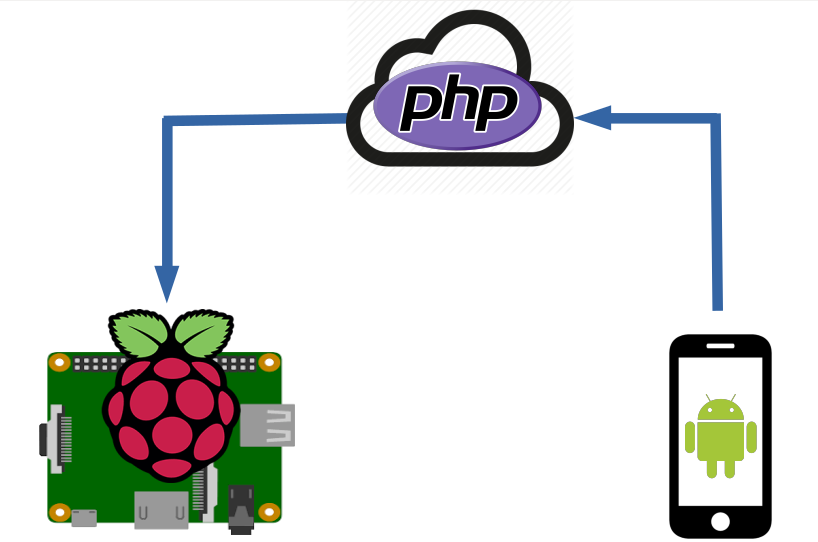

# Iot-RaspberryPi

This is a project implementing IoT using Raspberry Pi. Goal of the project is to control Raspberry Pi from anywhere in the world through cloud.

## Technologies -  
***Kotlin*** - Android application 
***JSON*** - Data exchange format 
***AJAX*** - For communication 
***PHP*** - Server side processing 
***Python*** - IoT communication and control language 
